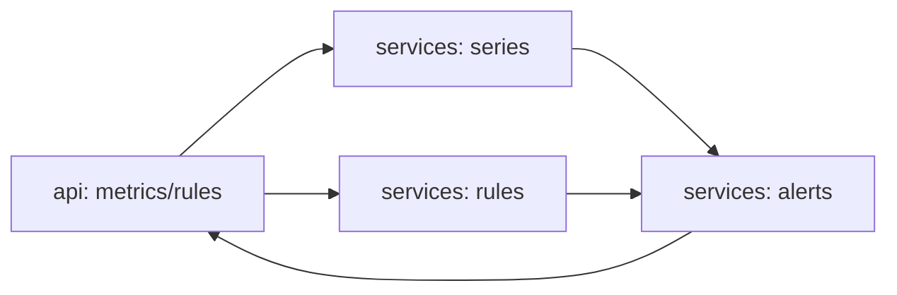

# agent-eagle-eye

[](https://github.com/Shamanchi/agent-eagle-eye/actions/workflows/ci.yml)
[](https://www.python.org/)
[](./Dockerfile)
[](./LICENSE)

> **English TL;DR:** FastAPI monitoring agent: ingest metric points, evaluate threshold rules and spike detection against a rolling window, keep an alert log with digest. Fully offline, no tokens needed.

Агент мониторинга: приём точек метрик, пороговые правила и детект всплесков по скользящему окну, журнал алертов с дайджестом. Работает офлайн.

Источник темы: `Hands-On-AI-Engineering / P-121 (eagle_eye)` — идею и постановку взяли из каталога, код и тексты написаны с нуля.

## Какую задачу решает

Нужно следить за метриками и не пропустить аномалию: агент хранит ряды, проверяет каждую точку по правилам («cpu > 90») и по всплеску относительно среднего окна, пишет алерты в журнал.

## Архитектура



Слои: `api/` → `services/` → `core/`, настройки через `pydantic-settings`.

## Быстрый старт

```bash
cp .env.example .env
pip install -r requirements.txt
uvicorn app.main:app --reload
curl -X POST http://127.0.0.1:8000/api/v1/rules -H "Content-Type: application/json" -d "{\"metric\": \"cpu\", \"op\": \"gt\", \"threshold\": 90}"
curl -X POST http://127.0.0.1:8000/api/v1/metrics -H "Content-Type: application/json" -d "{\"metric\": \"cpu\", \"value\": 95}"
```

Docker:

```bash
docker compose up --build
```

## API

- `GET /api/v1/health` — проверка сервиса.
- `POST /api/v1/rules` — правило: `{"metric": "cpu", "op": "gt"|"lt", "threshold": 90}`.
- `GET /api/v1/rules` — список правил.
- `POST /api/v1/metrics` — точка метрики: `{"metric": "cpu", "value": 95}`.
- `GET /api/v1/metrics?name=cpu` — ряд и статистика (min/max/avg/last).
- `GET /api/v1/alerts` — журнал алертов.
- `GET /api/v1/digest` — markdown-сводка.

Пример алерта (сокращённо):

```json
{
  "metric": "cpu",
  "value": 95.0,
  "kind": "threshold",
  "detail": "cpu 95.0 gt 90.0"
}
```

## Переменные окружения (.env)

| Переменная | Назначение | По умолчанию |
|---|---|---|
| `SPIKE_WINDOW` | Окно точек для среднего при детекте всплеска | `5` |
| `SPIKE_MULT` | Во сколько раз выше среднего — всплеск | `3.0` |
| `MAX_POINTS` | Хранить точек на метрику | `1000` |
| `APP_HOST` / `APP_PORT` | Хост/порт API | `0.0.0.0` / `8000` |

Полный список — в [.env.example](./.env.example).

## Тесты

```bash
pip install -r requirements.txt
pytest -q
pytest -q -m integration
```

Unit-тесты без сети. Интеграционные (`-m integration`) — через TestClient, тоже без сети.

## Контакты

- Telegram: @PavelYrevichh
- Email: Lietman46@mail.ru
- GitHub: Shamanchi
- FL.ru: https://www.fl.ru/users/Shamanchi
